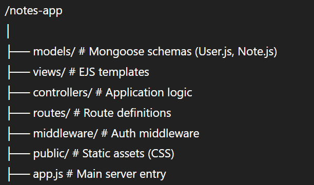

# 📝 Notes — A Full-Stack Note-Taking Web App

A secure and user-friendly note-taking application built using modern web technologies as a learning project to understand full-stack development, authentication, and the MVC architecture.

## 🚀 Project Goal

To explore and implement full-stack web development concepts including RESTful APIs, user authentication, and data modeling using a real-world application — a personal notes manager.

## 🛠 Tech Stack

- **Backend**: Node.js, Express.js
- **Frontend**: EJS (Embedded JavaScript Templates)
- **Database**: MongoDB, Mongoose
- **Authentication**: JWT (JSON Web Tokens), bcrypt for salting/hashing passwords, cookies for session management
- **Architecture**: MVC (Model-View-Controller)

## 🔐 Features

- User Registration & Login
- Password hashing using bcrypt
- JWT-based authentication with cookies
- Create, Read, Update, Delete (CRUD) functionality for notes
- Protected routes (only accessible to authenticated users)
- Server-side rendered views with EJS
- MVC code structure for modularity and scalability

## 📁 Project Structure



## 🧪 Installation & Usage

1. Clone the repo:
``` git clone https://github.com/vinay-nain/techT-Note-App.git ```
``` cd .\techT-Note-App ```

2. Install dependencies:
``` npm install ```

3. Set up environment variables in a `.env` file:
``` MONGO_URI=your_mongodb_connection_string ```
``` JWT_SECRET=your_secret_key ```

4. Start the server:
``` npm start ```